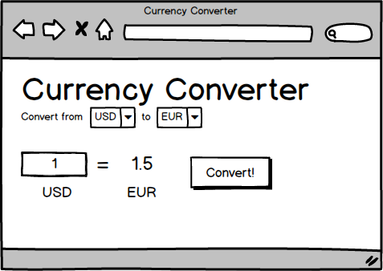

# Currency Converter using Ajax

In this project, you will use JavaScript and Ajax (using the `fetch()` function) to communicate with [the Exchange Rates API](https://exchangeratesapi.io/) in order to convert an amount of currency to another type of currency.

A mockup is provided below -- yours can look different!

## How to do it

To do this, you'll need three tools:

- DOM manipulation
- event listeners
- making fetch requests

You will need a list of currencies. You can code this in your HTML or build this via JavaScript when the page loads.

When someone clicks the convert button, you will want to:

- read the base and target currencies from their dropdowns
- read the currency amount from its form field
- make a fetch request to `https://api.exchangeratesapi.io/latest?base=BASE_CURRENCY_SYMBOL` where `BASE_CURRENCY_SYMBOL` is a placeholder for the base currency symbol
- use the data from the fetch request to calculate the target currency amount
- update the page with that amount

There are other events you should listen for: you will want to update the user interface whenever someone chooses a currency or changes the amount of currency they are converting.

We have provided a skeleton HTML, CSS, and JavaScript file for you to help you get started.

## Bonus idea

Add in information about the country and name for each currency so that your application is easier to use. Can you find a way to add a country flag for each one?
